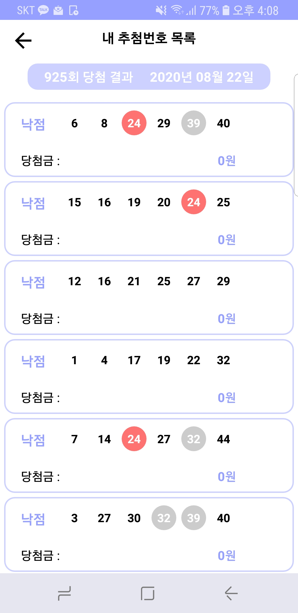

# [LottoLike](https://play.google.com/store/apps/details?id=com.lottolike.jaery.Lotto)

>어느 날 문뜩, 회차 관계없이 지금까지 생성한 로또 번호 목록 중 1등이 있었을까? 라는 호기심에서 진행된 프로젝트입니다.
현재 배포중인 4.1 버전에서는 생성한 번호목록을 매주 발표되는 당첨번호와 비교하여 등수를 계산합니다. 아쉽게도 10개의 번호목록과 5주차 동안 테스트 해보았지만 개발자인 저는 5000원도 당첨되지 못했습니다...




### 배포 버전 
 * **2.1**  -  2020/01/30
 * **3.4**  -  2020/04/11
 * **4.1**  -  2020/06/01

#### 3.4 feature

  * 로또 번호 추첨
  
  * ~~로또 회차별 당첨번호 확인~~
  
  * ~~지금까지 나온 번호 중 **순위 집산**~~
  
  * 매주 번호목록 등수 계산
     1. SQLite를 사용하여 매주 추첨 번호 저장/ 계산
 
  * QR코드 인식
  
  * ~~매주 알람 기능**~~
     1. AlarmManger로 구현
     2. 기기 별로 알람이 취소되는 현상 생김
    
#### 3.4 Bug

  * 로또 회차를 가져오는 Api의 인증서 만료로 앱의 로직이 꼬임
  
  * 기기 별 알람이 불 규칙하므로 오류 발생
  
#### 4.1 start
  > 목표 : 일부 Design 패턴 적용 (MVC)

  * 불 규칙한 알람으로 인한 앱 로직 오류를 방지하기 위해 로또 사이트의 최신 정보를 파싱하여 보여주는 것으로 변경
    - Develop 사이트를 보더라도 반복 예약 알림의 경우 정확한 알림을 사용하는 것을 되도록 피하라고 되어 있고 앱단의 AlertManager 보단 GCM으로 해결하라고 설명되어 있다. 이전 버전에서는 일주일 간격으로 정확한 알림 예약을 요구하다보니 기기의 배터리 사용 등 많은 리소스를 낭비하고 있다고 판단하여 알람 기능을 제거하였다.
  
  * Model이 분리되어 Unit Test로 Html 파싱 정보가 정확한지 확인
  
  ```java
  class LottoUnitTest {

    @Test
    fun getLottoDate() = runBlocking {
        val date : String = LottoUtil.getLottoRoundDate()

        Assert.assertEquals(date, "2020년 06월 27일")
     }
   }
  ```
  
  
